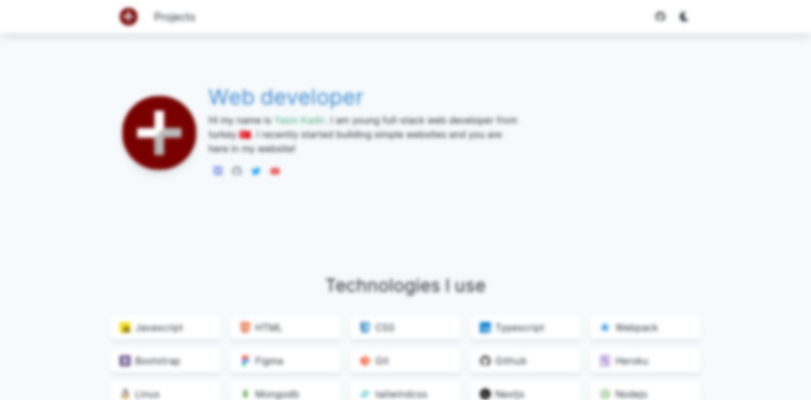

# [healthpackdev.cf](https://healthpackdev.cf)

<p align="center">
  
</p>

<p align="center">
 
 <br>
 <a href="https://vercel.com/new/git/external?repository-url=https://github.com/healthpackdev/website"></a>
 <a href="https://app.netlify.com/start/deploy?repository=https://github.com/healthpackdev/website"></a>
</p>

# Overview 

In a week, I build a personal website for me. It has fully static pages so you can host it anywhere. It is written in typescript and it uses React as a front-end library for ssr uses Next.js.

# Getting Started

### Requriments

- Node.js
- Git or Download repository as ZIP
- **Recommended**: pnpm faster than **yarn** and **npm**
### Running Locally
```shell
$ git clone https://github.com/healthpackdev/website
# or download as ZIP and extract it
$ cd website
$ npm run dev
# pnpm dev
```

