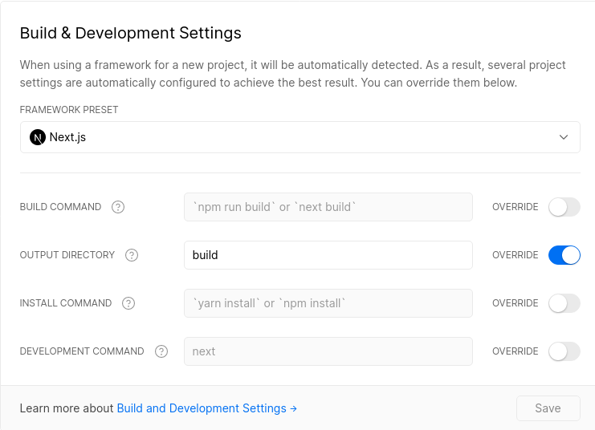

# [healthpackdev.cf](https://healthpackdev.cf)

<p align="center">
  
</p>

<p align="center">
 
 <br>
 <a href="https://vercel.com/new/git/external?repository-url=https://github.com/healthpackdev/website"></a>
 <a href="https://app.netlify.com/start/deploy?repository=https://github.com/healthpackdev/website"></a>
</p>

In a week, I published my new website although it wasn't completly finished. I planned more stuff but I can't build this with **chakra-ui**(`needs better performance`) and I got an idea to build a own `react ui` library. When I finish library I will add more features and pages.

# Overview and todos

- [x] it has fully **static** pages.
- [x] it has **docker** support for development.
- [x] it has **Netlify** and **Vercel** support.
- [x] it fully built with **chakra ui** and **typescript**
- [x] it has tidy folder structure.
- [x] it generates **sitemap.xml** at build.
- [ ] it has **commitlint** system.
- [ ] it generates **favicons** automatic at build **(you can use [favicon](https://realfavicongenerator.net) generator)**.
- [ ] it has custom **Eslint** config **(now using airbnb)**
- [ ] it has static blogging and snippets.

# Getting Started

### Requriments

- if you don't have **node.js** in your system you should install it for local development
(this repository definitely support node v14 and v15)

- if you need better performance and version testing you should install **docker**and **docker-compose**

- if you don't have **git cli** in your system you should install it for cloning repository or you can click ` Code > Download ZIP`:

- **Recommended**: if you need faster installing and script running you should use **pnpm** it faster than **yarn** and **npm** you can install with `npm install -g pnpm`


### Local Development

First of all, clone this repository with 
```shell
git clone https://github.com/healthpackdev/website
```
After write
```shell
cd website
```
for starting app in development mode write
```shell
npm run dev
# pnpm dev
```

### Local Production
configure `config/site-config.json` for you after write these
```shell
npm run build
npm run start
# pnpm build
# pnpm start
```

### deploy in host service
You can deploy with `Netlify` and `Vercel` or maybe `AWS lambda`

 <a href="https://vercel.com/new/git/external?repository-url=https://github.com/healthpackdev/website"></a>
 <a href="https://app.netlify.com/start/deploy?repository=https://github.com/healthpackdev/website"></a>

**NOTE**: if you hosting with vercel you should configure `Build & Development Settings` such as:

<p align="center" ></p>

# FAQ

<details>
<summary>Can I deploy this app in <b>Cloudflare Pages</b>?</summary>

**Yes**. you can deploy in cloudflare pages see
[Cloudflare docs](https://developers.cloudflare.com/pages/how-to/deploy-a-nextjs-site)


</details>
<br>
<details>
<summary>Can I deploy this app in <b>Heroku</b>?</summary>

**Maybe**. I tried 5 times but it returns `heap out of memory` error so I don't know
</details>